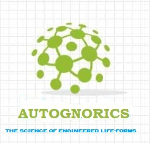

# autognorics.github.io
WELCOME TO THE WORLD OF ANEURAL AUTOGNORICS 👋

Autognorics is the science of creating engineered life forms, things, machines, or systems. It was conceptualized by revisionist Lawsin in 1988 who wanted to shape up the framework of artificial intelligence and machine learning by introducing a new paradigm known as Aneural Autognorics. In this new paragon of creating synthetic life-forms, called Gnorics, IOs and EIs are the fundamentals units. 

ELFS or Engineered Life-forms Systems, technically named Autognorization, is the system, process, or approach where intuitive objects, embedded inscriptions, and the inverse-reverse dimetrix are incorporated together in the creation of a living machine or system that embodies the six signatures of life, namely: the mechanization of aliveness, the sensation of awareness, the codification of consciousness, the intuitiveness of logic, the emergence of selfness, and the experience of living.

According to Lawsin, Life evolves from being alive to being living. It is a process that is governed by six stages. These signatures are based on the states of being of the individual. These Six Orders of Life are as follows:

1. Aliveness = is the ability to consume energy without the need for neural reasoning.
2. Awareness = is the ability to send and receive signals using intuitive sensors without the need for neural reasoning.
3. Consciousness = is the ability to match things with things without the need for neural reasoning.
4. Intutiveness = is the ability to choose this or that without the need for neural reasoning.
5. Selfness = is the ability to inlearn or self-knowledge.
6. Lifeness = is the ability to experience life.

But before we dive deeper on the orders of life, let us examine first the old basic criteria of Life:

* Living things consume food in the form of energy (eat).
* Living things take and expel gas (breathe).
* Living things are moving or in motion (perform).
* Living things reproduce with an exact copy of themselves (replicate).
* Living things grow with their surrounding environment (thrive).
* Living things respond with their sensors (sense).
* Living things are made up of cells.

However, there are living organisms that lack one or more of these characteristics but are still considered alive, like for example the non-cellular micro-organisms that exist without cells. The seed, a non-living thing that produces a tree, a living thing. The virus, chemical machinery, that becomes alive when living with a host. And the neuron, a non-living thing that produces awareness common to living things when confined in a network.

On the other hand, being Alive can also be defined according to the criteria of being dead. To be considered dead, medically, and legally, the individual has undergone:

* Total failure of the heart.
* Total failure of the lungs.
* Total failure of the brain stem.

But again, there are living organisms without brains, lungs, and hearts but are considered alive. Trees, flowers, and jellyfish do not have hearts, lungs, or even brains but are living things. Another example is the Trichoplax, an organism without organs. This living creature of the kingdom Monera can walk without feet, eat without a mouth, digest without a stomach, and reproduce without reproductive organs.

Therefore, there is really no definite criterion that defines when an object is alive. However, by deduction and elimination, one common factor that shines among our criteria is the ability of an organism to self-consume energy. In order for something to move, reproduce, react and make the heart, lungs, and brain function, it needs energy. 

Thus, when an object self-consumes energy from food, batteries, sunlight, sound, motion, or any external source of energy, such an object is ALIVE. 

In this [video](https://www.youtube.com/watch?v=hPgEEafvwsQ&feature=emb_title), the machine is alive because it powers itself by self-consuming energy from external sources. Aside from energy, the machine becomes animated mechanically because of its structure and design. This automated mechanical self-animation is known as Animation Inscripted by Design or A.I.D.  The animation or aliveness is due through energy, animation, and inscriptions.

The machine in the video might be alive, but again it is not living or with life. When its battery receives an infinite constant flow of energy, either by solar panels or charging stations, the machine will always be in motion indefinitely much like the jellyfish ( an animal without a brain, a heart, or blood) that floats aimlessly at sea as it simply continuously reacts unknowingly with its outside world. The jellyfish is alive but without a brain (aneural), a heart (acardial), and blood (ahemial) .

On top of this, there are other creatures who are:

* alive but without brains, 
* alive but not conscious, 
* alive but not aware, 
* aware but not conscious, 
* aware but no brains, 
* conscious but not aware, and 
* conscious but not self-cognizant. 

Remember, Life is a process. It evolves from being alive to being living.

In the succeeding articles, the following new ideas in the creation of a Living Machine are deliberated:
1. [The Sensoric Awareness of a Machine](https://autognorics.github.io/Sensoric_Awareness/)
2. [The Aneural Consciousness of a Machine](https://autognorics.github.io/Aneural_Consciousness/)
3. [The Algorithmic Intuitiveness of a Machine](https://autognorics.github.io/Algorithmic_Intuitiveness/)
4. [The Neural Selfness of a Machine](https://autognorics.github.io/Neural_Selfness/) 
5. [Intuitive Objects and Embedded Inscriptions](https://autognorics.github.io/Intuitive_Objects/)
6. [A Brain without the Brain Paradigm](https://autognorics.github.io/Aneural-Intuitive-Systems/)
7. [The Making of a Living Machine](https://autognorics.github.io/Engineered_Life_Forms/)
8. [Autognorics:The Science of Engineered Life Forms](https://autognorics.github.io/Autognorics)

⚡ Originemology: 
The etymology, originator, founded, history, semantics, onomatology, eponym:
*eaftos = self
*gnosei = knowledge
*aftognosia = self-knowledge
*zois = life-forms
*autognozics = self-knowledge life-forms
*ELFS = engineered life-forms systems
*Autognorics = the science of creating living machines
*(Lawsin,1988)

> "The Building Blocks of Life are made up of Invisible Shapes and Empty Spaces." ~ Joey Lawsin
